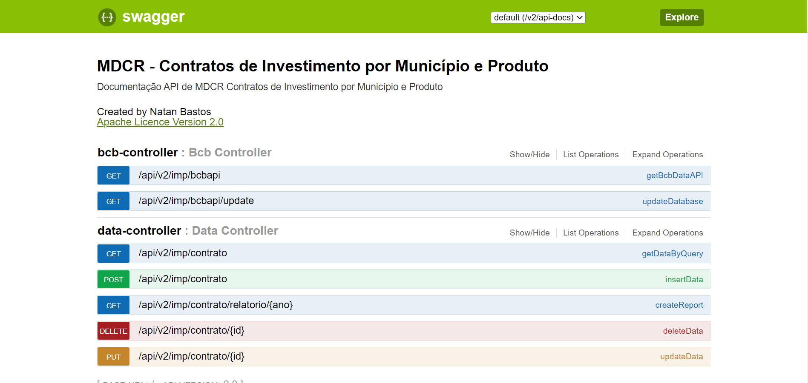

# Desafio MDCR - Contratos de Investimento por Município e Produto
<div align="center">

   

</div>



## Configurações de ambiente

### Banco de dados
---
Banco de dados: MySQL

Nome do banco de dados: bcbdata

Comando para criação
```sql
create database bcbdata;
```
No arquivo **application.properties** trocar a porta do banco caso seu mysql não rodar na porta padrão.

Porta padrão: 3306

**Não alterar o resto da URL**

Exemplo da linha abaixo:

```java
spring.datasource.url=jdbc:mysql://localhost:3306/bcbdata?useSSL=false&allowPublicKeyRetrieval=true&useTimezone=true&serverTimezone=GMT
```

A tabela é automaticamente gerada ao rodar a API pela primeira vez.

### API
---
Nas configuracoes da API, esta definido para pegar 100 registros do banco central e salvar no banco de dados, para alterar a quantidade de registros, basta editar o arquivo **BcbEndPoint**.

Na URL na parte *$top=100* altere para o valor desejado.

**Não alterar o resto da URL**

Exemplo da linha abaixo:

```java
@FeignClient(name = "bcb", url="https://olinda.bcb.gov.br/olinda/servico/SICOR/versao/v2/odata/InvestMunicipioProduto?$top=100&$format=json")
```

Após todas essas configurações, basta iniciar a API e bater no endpoint de
onboarding de dados abaixo:

```url
http://localhost:8080/api/v2/imp/bcbapi/update
```

### Arquivos Importantes

**Controllers**

*BcbController* - Responsavel pelos endpoint que atualizam o banco de dados.

*DataController* - Responsavel por todos os endpoint de CRUD.

**DTO**

*DataDTO* - Responsavel por transformar os dados em JSON.

*ReportDTO* - Entidade que converte os dados de soma anual de produtos para JSON.

**Entity**

*BcbDataEntity* - Entidade que recebe os dados do JSON.

**Feign Client**

*feignclient* - Responsavel por bater na API do banco central.

**Repository**

*DataRepository* - Responsavel pela operacoes no banco de dados.

**Service**

*DataService* - Responsavel por todas operacoes logicas do sistema.